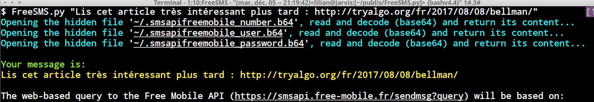
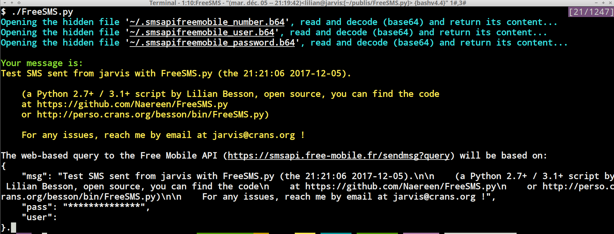
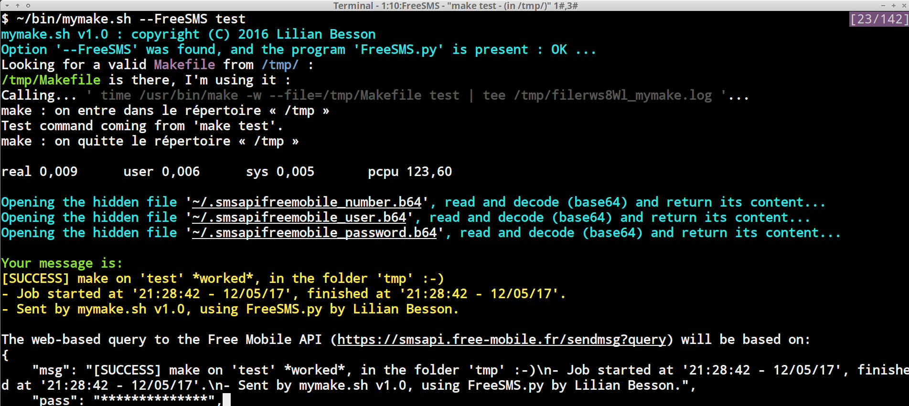

# :fr: :phone: FreeSMS.py

Un petit script Python 2 ou 3 pour s'envoyer des textos (messages SMS) en ligne de commande, via l'[API de Free](https://mobile.free.fr/account/mes-options/notifications-sms) ([ancien lien](https://mobile.free.fr/moncompte/index.php?page=options&show=20)) (uniquement pour un téléphone avec une carte SIM Free).

## Exemples
### Usage simple
1. [Installer ce script](#Installation),
2. Configurer l'API SMS de Free, via [votre espace client](https://mobile.free.fr/account/mes-options/notifications-sms), et noter votre identifiant et clé d'accès à l'API,
3. Lancer une première fois le script `FreeSMS.py` pour savoir comment stocker ces deux codes,
4. Tester avec un exemple :
    ```bash
    FreeSMS.py "Lis cet article très intéressant plus tard : http://tryalgo.org/fr/2017/08/08/bellman/"
    ```
5. Soyez tout content :+1: ! Et ajouter une [petite étoile](https://github.com/Naereen/FreeSMS.py/stargazers) :star: à ce projet !

Cela va vous envoyer un texto contenant ce texte, si tout est bien configuré.



### Aide
L'usage du script est le suivant :

```bash
FreeSMS.py --help|-h | -f file | body of the message
```

- Sans argument, envoie un message de test,
  

- Avec `-h` ou `--help`, affiche l'aide,
- Avec `-f FILE`, envoie le contenu de ce fichier (en plusieurs morceaux si besoin).

### Aide détaillée
```bash
$ ./FreeSMS.py --help
Opening the hidden file '~/.smsapifreemobile_number.b64', read and decode (base64) and return its content...

FreeSMS.py --help|-h | -f file | body of the message

A simple Python script to send a text message to a Free Mobile phone.
The message should be smaller than 480 caracters.

Examples:
$ FreeSMS.py --help
Print this help message!

$ FreeSMS.py -f MyMessageFile.txt
Try to send the content of the file MyMessageFile.txt.

$ FreeSMS.py "I like using Python to send me SMS from my laptop -- and it's free thanks to Free !"
Will send a test message to your mobile phone.

Copyleft 2014-17 Lilian Besson (License MIT)
THE SOFTWARE IS PROVIDED "AS IS", WITHOUT WARRANTY OF ANY KIND.
```

### Usage automatisé ?
Mon script [mymake.sh](https://bitbucket.org/lbesson/bin/src/master/mymake.sh) enrobe l'outil [GNU make](https://www.gnu.org/software/make/) pour m'envoyer un texto quand une simulation est terminée (avec un texte différent selon un échec ou une réussite).

  

#### Suggestions
- J'utilise des Makefile pour lancer mes simulations numériques sur un serveur de calcul, afin de me prévenir en cas d'erreur ou quand les calculs sont finis,
- Par exemple, [pour ces simulations](http://banditslilian.gforge.inria.fr/How_to_run_the_code.html#Using-env-variables-?),
- Et avec un fichier `.use_FreeSMS_for_mymake` créé dans le HOME, l'option `--FreeSMS` est activé par défaut.


### Cas d'échec
Le script est traduit en français et anglais, et il affiche des messages d'erreurs clairs selon les causes d'échec.

----

## Installation
### Manuellement ?

Facile !
Cloner ce dépôt, aller dans le dossier, et déplacer le script [`FreeSMS.py`](FreeSMS.py) dans un autre dossier accessible dans votre `$PATH`.

Au premier lancement du script, il vous expliquera comment créer les fichiers privés nécessaires à l'utilisation de `FreeSMS.py`, et les stocke dans votre HOME (`~`) :

- [`~/.smsapifreemobile_user.b64`](.smsapifreemobile_user.b64) : contient votre identifiant de compte Free,
- [`~/.smsapifreemobile_password.b64`](.smsapifreemobile_password.b64) : contient votre mot de passe,
- [`~/.smsapifreemobile_number.b64`](.smsapifreemobile_number.b64) : contient votre numéro de téléphone, encodé en base 64.

Les trois fichiers fournis en exemple ne sont, bien-sûr, pas valides, mais montre la forme qu'ils doivent avoir.

En résumé, exécuter ça :

```bash
cd /tmp/
git clone https://GitHub.com/Naereen/FreeSMS.py
cd FreeSMS.py/
cp FreeSMS.py /un/dossier/dans/votre/PATH  # exemple ~/.local/bin/
FreeSMS.py   # va vous aider à créer ~/.smsapifreemobile_number.b64  ~/.smsapifreemobile_password.b64  ~/.smsapifreemobile_user.b64
```

> Si quelque chose ne fonctionne pas bien, merci [de signaler un problème](https://github.com/Naereen/FreeSMS.py/issues/new) :clap: !

### Avec `pip` ?
TODO: [écrire un `setup.py` pour installer ça !](https://github.com/Naereen/FreeSMS.py/issues/2)

Vu son usage très restreint, ce projet ne sera **pas** distribué sur [le dépôt de packet Pypi](https://pypi.org/), mais il peut être installé directement depuis GitHub avec [`pip`](http://pip.pypa.io/) et cette commande :

```bash
sudo pip install git+https://github.com/Naereen/FreeSMS.py
```

Vérifiez que vous utilisez `pip2` ou `pip3` selon la version de Python pour laquelle vous voulez installer cet outil.  ([Python 3 est évidemment recommandé](https://pythonclock.org/))


----

## Comparaison à d'autres projets

- https://github.com/bfontaine/freesms est un module et pas un script, qui fait en gros la même chose. L'avantage de son approche est de pouvoir être facilement utilisée par d'autres applications en Python, l'avantage de mon approche est d'être très facile à utiliser depuis un terminal et donc des scripts Bash (cf. [cet exemple, `mymake.sh`](https://bitbucket.org/lbesson/bin/src/master/mymake.sh#mymake.sh-197)).

- ?

----

## À propos :notebook:
### Langage et version(s) ?
Python v2.7+ ou Python v3.1+ (version CPython).

### :scroll: Licence ? [](https://github.com/Naereen/badges/blob/master/LICENSE)
Ce script et cette documentation sont distribuées en accès libre selon les conditions de la [licence MIT](https://lbesson.mit-license.org/) (cf le fichier [LICENSE](LICENSE) en anglais).
© [Lilian Besson](https://GitHub.com/Naereen), 2017-2021.

> Merci à [Thibault Groueix](https://github.com/ThibaultGROUEIX) pour des tests et des commentaires utiles en juillet 2016 et novembre 2017.

[](https://GitHub.com/Naereen/FreeSMS.py/graphs/commit-activity)
[](https://GitHub.com/Naereen/ama.fr)
[](https://GitHub.com/Naereen/FreeSMS.py/)

[](http://ForTheBadge.com)
[](https://GitHub.com/)

[](https://www.python.org/)
[](https://GitHub.com/Naereen/)
